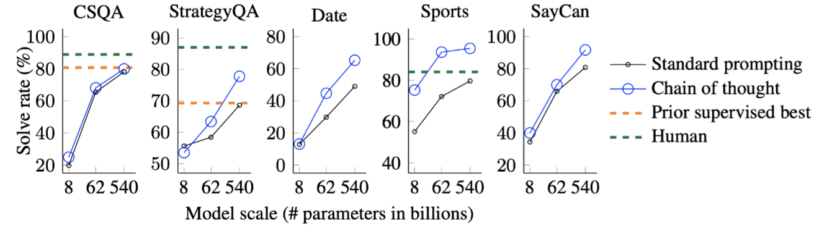

# Chain-of-Thought Prompting Elicits Reasoning in Large Language Models

作者：Jason Wei，Xuezhi Wang，Dale Schuurmans，Maarten Bosma，Brian Ichter，Fei Xia，Ed H. Chi，Quoc V . Le，Denny Zhou

机构：Google Research，Brain Team

## 目录
- [Chain-of-Thought Prompting Elicits Reasoning in Large Language Models](#chain-of-thought-prompting-elicits-reasoning-in-large-language-models)
  - [目录](#目录)
  - [动机](#动机)
  - [方法](#方法)
  - [实验](#实验)
    - [算术推理](#算术推理)
      - [数据集](#数据集)
      - [主实验](#主实验)
      - [分析实验](#分析实验)
      - [消融实验](#消融实验)
      - [稳健性（Robustness）分析](#稳健性robustness分析)
    - [常识推理](#常识推理)
      - [数据集](#数据集-1)
      - [主实验](#主实验-1)
    - [符号推理](#符号推理)
      - [数据集](#数据集-2)
      - [主实验](#主实验-2)
  - [局限性](#局限性)
  - [总结](#总结)

## 动机
单纯的扩大LLM模型的参数量无法让模型在算术推理/常识推理/符号推理等推理任务上取得好的效果。
如何提升LLM在这些推理任务上性能呢？

## 方法
首次提出思维链（Chain of Throught，CoT）的概念，思维链就是一系列中间的推理步骤(*a series of intermediate reasoning steps*)。

 

上面这个例子可以很好的说明思维链到底在做什么。左图是传统的1-shot prompting，就是拼接一个例子在query的前面。右图则是CoT的改进，就是将example中的Answer部分的一系列的推理步骤（**人工构建**）写出来后，再给出最终答案。逻辑就是希望模型学会一步一步的输出推理步骤，然后给出结果。

## 实验

### 算术推理

#### 数据集

1. GSM8K
2. SVAMP
3. ASDiv
4. AQuA
5. MAWPS

#### 主实验

三个重要结论：

- **CoT对小模型作用不大，模型参数达到100B左右效果才明显**。并且，作者从小模型的输出可以看出，它们大部分是输出了流畅但不合逻辑的CoT，因此得到错误的结果。
- **CoT对复杂的问题的性能增益更大**，例如GSM8K（更难，因为基线最低）上GPT-3和PaLM的性能增加了一倍多。而对于MAWPS-SingleOp（更简单的任务），性能改进非常小甚至是负面的。（为什么呢？猜测是CoT的生成还是不够准确，会存在噪声，导致最终结果变差？）
- **加上CoT的PaLM 540B超过了任务特定的用监督学习训练的模型的最优结果**。不加CoT的话GSM8K和MAWPS任务上LLM的结果比不过最优的监督学习模型。

#### 分析实验

对LaMDA 137B模型做了更具体的case study，看看加了CoT的结果是模型真的做对了，还是蒙对的。

**具体做法**：随机选择模型预测正确的test samples中的50个samples，人工检查其生成的CoT是否是正确的（不仅仅关注最终结果是否正确），最终发现只有两个CoT生成不正确但结果正确（即结果是蒙的）。**大概4%左右是蒙的**。然后，再随机选择50个预测错误的test samples。46%是大部分正确而由于一些小错（计算错误/符号映射错误/缺少一步推理等）导致最终的错误，还有54%是存在重大错误（语义理解和连贯性上的错误）。

通过增加PaLM的参数量（62B->540B），模型可以修复部分错误。**没有进行更具体的case study，例如每个类型的错误中可以通过增加参数量解决的错误主要有哪些？哪些问题是无法通过增加参数量来解决的？有了这个分析可以更有针对性的对LLM进行改进。**

以上实验说明，通过增大参数量，模型确实可能涌现出一些特殊的能力，如更好的语义理解/符号推理/算术能力等。**为什么会有这样的能力出现？其中预处理数据，模型架构和优化目标分别起了什么作用？以上都是需要进一步探索的方向。**

#### 消融实验

实验了三个CoT的变种：

1. **把CoT中的文字去掉，只保留公式部分**。

    结论：效果对于原始prompt略有提升，对简单任务提升较多，但和CoT没法比，特别是对于复杂任务，几乎没有提升。

2. **把CoT中的token全换成点（…）**。
这是为了验证额外的计算量是否是影响模型性能的因素。

    结论：全换成点后效果和原始prompt没什么区别。
计算量用的多了对结果影响很小（几乎没有影响），
也说明了CoT中的人工构建的CoT（token sequence）对结果影响很大。

3. **把思维链放到生成结果之后**。
这样做的原因是：猜测CoT奏效的原因可能仅仅是这些CoT简单的让模型更好的访问了预训练期间获得的相关知识，而与推理没啥太大关系。

    结论：CoT放到生成的答案之后的效果和benchmark没太大区别，说明CoT的顺序逻辑推理还是起到了很大作用的（不仅仅是激活知识），换句话说，模型确实是依赖于生成的思维链一步一步得到的最终结果。

#### 稳健性（Robustness）分析

对人，exemplars和models三个方面进行了稳健性分析。

比较统一的结论就是思维链普遍有效，但是不同的CoT构建方式/exemplars的选择/数量/顺序都是会对模型的正面影响的方差还是很大的。

- **让不同人去构建CoT**，尽管每个人构建的CoT都不相同，但都对模型性能产生了正面的影响，说明CoT确实有用，但是另一方面，不同人给出的不同的CoT对最终结果的影响程度还是有很大不同的，说明如何更好的构建CoT还是值得去好好思考的（还是回到了prompting engineering）。作者还特地强调annotators不需要有机器学习背景（完了，唯一一点小优势也没有了hhhh）。

<!-- - **换一波exemplars**（就是选择不同的8个训练数据作为exemplars）。结论仍然是CoT普遍有效，但不同的训练数据会对最终结果产生不同大小的正面影响。 -->

- **Exemplars样本的选择**。不同的选择都会有提升，但是差异明显。特别是，在一个数据集上选择的exemplars可以用在其他数据集上，比如本文的实验设置，对于同一种类型的问题，如算术推理，尽管用了几个不同的数据集，但都是用的相同的8个exemplars，结果没有特别大的差异，说明不需要exemplars满足和test set相同的分布，这还挺令人惊讶的，不过估计分布也不能差异太大，比如把其他事实性推理任务的exemplars用在算术推理上估计不太行（有待验证）。

- **Exemplars样本的顺序**。整体影响不大，除了coin flip task，可能的原因是 同一个类别的多个exemplars连续输入模型使其输出产生了偏差（bias）。例如把4个负样本放到4个正样本的后面输入到模型中，可能导致模型更加倾向于输出负label。整体来说顺序对模型的影响有待进一步分析。

- **Exemplars样本的数量**。
  
    
  
    对于标准prompt，增加exemplars对最终结果的影响不大。对于CoT，增加exemplars对模型有影响（在某些数据集上），并且也不是越大越好，这个是为什么呢？原因还有待探索。

- **不同的LLM上的效果**。
  对于一个LLM效果好的CoT exemplars set换到其他LLM上效果不一定好，也就是说CoT对模型的提升是无法在不同的LLM上传递的，这是一个局限。后续可以研究下为什么，或许预训练语料、模型架构和优化目标与CoT有着某种潜在的关系。

作者给出的结论：

**Prompt Engineering仍然很重要！**
不同的prompt（CoT）的设计/数量/顺序都会对模型产生不同的影响，且方差还是很大的。
因此未来的一个方向可能是探索一种annotation的模型来得到稳健的CoT（Prompts）。
或许可以用一个LLM自动生成CoT用于Prompting。（通过验证集优化） —> Auto CoT（已经有人做了）。

### 常识推理

#### 数据集

1. CSQA
2. StrategyQA
3. Data Understanding (from BIG-Bench) 
4. Sports Understanding (from BIG-Bench)
5. SayCan

不同的数据集采用了来自自身数据集中选择的exemplars并人工构建CoT，数量也有所不同，CSQA(7), StrategyQA(6), Data Understanding (6), Sports Understanding (8), SayCan (7), 数据来自论文附录G。

#### 主实验

结论：说明CoT在常识推理任务上也有用，但是为什么在CSQA上没用？针对那种类型的常识性推理任务有用？为什么会失效或奏效都是可以继续研究的问题。

### 符号推理

#### 数据集

1. Last letter concatenation *(e.g., "Amy Brown" → "yn")*
2. Coin flip *(e.g., "A coin is heads up. Phoebe flips the coin.
Osvaldo does not flip the coin. Is the coin still heads up?"→ "no")*

这两个数据集都是自己构建的，前一个是通过从姓名普查数据中随机串联前1000个名和姓来生成全名(https://namecensus.com)。后一个则是完全一样的句子结构，主要是把名字换一换。

#### 主实验

其中in-domain就是exemplars和test samples的单词数量或翻转次数相同。
OOD就是它们的单词数量或翻转次数不同，比如exemplars里单词数量都为2，而test samples里的则为3或4。

**结论**

首先可以看到对于LLC任务来说，**10B以下的模型，无论in-domain还是OOD，模型都完全不会做（0.0%）**，尽管对于indomain来说，标准的推理步骤都已经在exemplars里提供了，还是不会做。只有模型规模达到10B以上，模型才逐步可以cover这种任务，**用了CoT直接起飞（7.6->99.4）**。翻转硬币任务用了CoT也是同样直接起飞(49.3->98.6)。

<!-- ## 总结

作者抛砖引玉，给出了两个可以进一步研究的方向：
1. 使用CoT之后，模型规模的继续提升会让模型性能继续提升吗？又会有多大的提升呢？提升的上限又是什么呢？
2. CoT可以算作是一种prompting的方法，有没有其他方式的prompting方法可以拓展LLM的任务列表及任务性能？ -->

## 局限性

CoT方法目前的**局限**：
1. 尽管作者设计的CoT在模拟人类的推理过程，但模型是否真正学会了推理？有待继续考证（一个开放性的问题）。
2. 手工构建CoT的cost很大，小样本场景可以接受，但无法用于微调（即大规模的人工标注CoT是不可行的，该问题或许可以被自动数据生成和零样本数据生成方法解决）。
3. 无法保证正确的推理路径，这会导致错误的答案。改进语言模型的事实生成(factual generations, 狭义的指推理路径，广义的指所有生成的事实性内容)是未来工作的一个方向。
4. CoT只在大模型上有用（>10B）。在真实世界中很多场景无法使用大型LLM，探索如何在小模型上使CoT奏效是一个未来的研究方向。换句话说，进一步的研究可以探索如何在较小的模型中诱导模型推理（生成推理过程），但是小模型是否真的有这样的能力呢？没有的话如何引导应该都是徒劳吧？或许小模型需要通过带有CoT的语料微调使其先习得推理的能力更合理一些？

## 总结

本文首次提出思维链(CoT)的概念，思维链简单的说就是一系列中间推理步骤。本文最大的贡献就是发现了在LLM生成推理任务的结果之前，先生成思维链，会使模型的推理性能有大幅度的提升，特别是在困难的推理任务上。但是有个前提就是LLM的规模要大于10B，否则CoT没用甚至起副作用。

CoT的一大好处是无需微调模型参数，仅仅是改变输入就可以改进模型的性能。随着LLM越来越大，高校和小企业可能无法承担训练LLM的成本，因此无法参与其中进行科研与实践，但CoT这个研究方向仍然可以做。

未来可以继续探索的方向：
1. 具体分析当前CoT无法解决的推理错误类型，探索无法解决的原因，更有针对性的对当前CoT进行改进。
2. 探索预处理数据，模型架构和优化目标(预训练任务)和CoT之间有着何种关系，以此为基础为不同的Model设计不同的CoT。
3. 探索不同的CoT的设计和构建方式/exemplars的选择/数量/顺序对模型的影响。
4. 自动生成CoT(或者其他降低人工构建CoT的成本的方法)。
5. 针对特定任务特定应用场景设计具体的CoT最大化发挥LLM的性能(通过CoT或者说Prompts将LLM引导到特定领域中)。
6. 提升模型生成的事实性内容的正确性，引入知识图谱或其他结构性知识？
7. 将CoT拓展到小型LLM上(目前的CoT只是在大型LLM(>10B)上有用)。
8. 探索其他形式的prompting构建方法以拓展LLM的任务列表及任务性能(CoT可以看作是一种prompting的构建方法)。